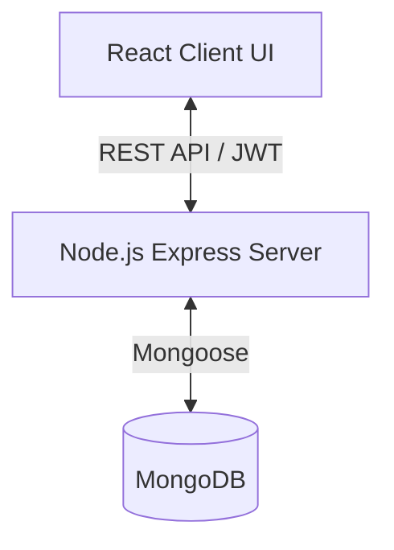

# System Architecture

The **SPHN (Smart Traffic Violation Reporting & Analytics System)** is a modern, decoupled full-stack application. It leverages a microservices-inspired architecture with distinct layers for the frontend, backend API, and AI processing.

## 1. High-Level Architecture

The system consists of three primary components:

1.  **Frontend (React/Vite)**: The user interface for citizens, police, and administrators.
2.  **Backend (Node.js/Express)**: The core API server handling business logic, database operations, and user authentication.
3.  **Database (MongoDB)**: The primary data store.

### Component Diagram



## 2. Component Details

### 2.1 Client Layer (`client/`)
-   **Framework:** React 18 powered by Vite for rapid development and optimized builds.
-   **Routing:** React Router DOM handles client-side routing.
-   **State Management:** React Context API (e.g., `AuthContext`) is used for global state like user authentication status.
-   **Styling:** Vanilla CSS with modern features (CSS variables, flexbox, grid, glassmorphism UI).
-   **Maps:** Leaflet mapping library for violation location plotting.
-   **Charts:** Recharts for analytics dashboards.

### 2.2 Server Layer (`server/`)
-   **Framework:** Node.js with Express.js.
-   **Authentication:** JWT (JSON Web Tokens) are used. Passwords are hashed using `bcrypt`.
-   **Security:**
    -   `helmet` for setting secure HTTP headers.
    -   `cors` configured to allow specific frontend origins.
    -   `express-rate-limit` to prevent brute-force attacks.
    -   Custom sanitization middleware for XSS prevention.
-   **File Uploads:** Handled via `multer`. Images are stored in the local `uploads/` directory (can be easily adapted for AWS S3).
-   **Database ORM:** Mongoose is used to model User and Report schemas.

## 3. Data Flow Example: Submitting a Report

1.  **User Action:** A citizen logs in and submits a violation report with a photo via the React frontend.
2.  **API Request:** The frontend sends a `multipart/form-data` POST request to the Node.js backend.
3.  **Upload Handling:** The backend's `multer` middleware saves the image to the `uploads/` folder.
4.  **Database Write:** The backend combines the user data, image path, and location, then saves the new `Report` document to MongoDB.
5.  **Response:** The backend returns a success message to the React client, which redirects the user to their report history.
6.  **Review (Police):** A police officer reviews the report, checks the media, manually verifies the number plate and vehicle type, and issues a status update (approve/reject).

## 4. Directory Structure Mapping

```text
Project SPHN/
├── client/                 # Frontend React Application
│   ├── src/
│   │   ├── components/     # Reusable UI components
│   │   ├── context/        # React Context (AuthContext)
│   │   ├── pages/          # Full page views (Home, Login, Dashboards)
│   │   ├── services/       # API wrapper functions
│   │   └── styles/         # CSS files
├── server/                 # Backend Express API
│   ├── config/             # DB connection config
│   ├── controllers/        # Route handler logic
│   ├── middleware/         # Auth, Upload, Security middlewares
│   ├── models/             # Mongoose schemas
│   ├── routes/             # API route definitions
│   └── uploads/            # Stored user media
```
